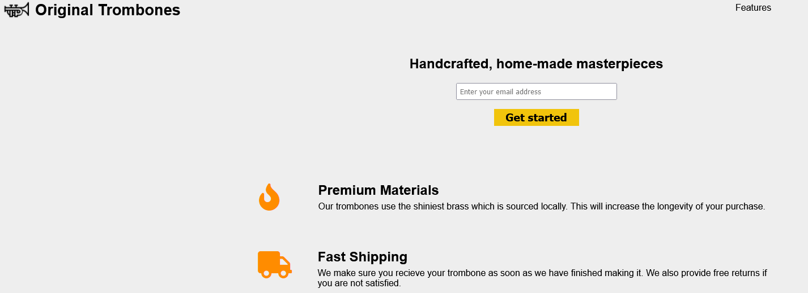

# FreeCodeCamp - Landing Page

This is a solution to the landing page on FreeCodeCamp. 

## Table of contents

- [Overview](#overview)
  - [The challenge](#the-challenge)
  - [Screenshot](#screenshot)
  - [Links](#links)
- [My process](#my-process)
  - [Built with](#built-with)
  - [Continued development](#continued-development)  
- [Author](#author)

## Overview

### The challenge

Users should be able to:

- Recreate landing page via FreeCodeCamp and make responsive.

### Screenshot

### Links

- Live Site URL: [https://snellc1.github.io/NFT-Card/](https://snellc1.github.io/NFT-Card/)

## My process

### Built with

- Semantic HTML5 markup
- CSS custom properties

### Continued development

- Need to improve using @media. 
- Improve on creating smooth transitioning responsive pages.  

## Author

- Website - [Christopher Snell](https://github.com/snellc1/FreeCode-LandingPage)

